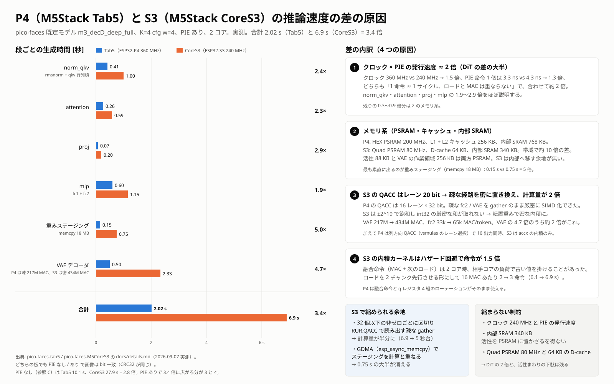

# 内部構成と測定（CoreS3）

[README](../README.md) に書かなかった詳細です。Tab5 版の [docs/details.md](https://github.com/nnn112358/pico-faces-tab5/blob/main/docs/details.md)
と同じ構成で、CoreS3（ESP32-S3）で違う点を中心に書きます。

## 構成

```
CMakeLists.txt              PF_MODEL の選択、モデル blob の埋め込み
main/main.cpp               画面（M5GFX、320×240）・タッチ・USB シリアル・生成タスク
main/pf_par.c               rf_par_for を FreeRTOS の 2 タスク（コア 0 / 1）で実装。段ごとのプロファイルと待ち合わせの検査
components/pf_engine/       upstream/engine/src/*.c をそのままコンパイルするコンポーネント
components/pf_engine/pie/   影のヘッダ生成（make_shadow.py）、S3 の内積カーネル（rf_ops_pie.h）、
                            重みステージング・疎な経路の密化・自己テスト（pf_pie_s3.c）
tools/serial_cmd.py         USB シリアルにコマンドを送る補助（DTR/RTS を動かさない、ポート自動検出）
upstream/                   git submodule: cpldcpu/pico-faces
sdkconfig.defaults          CoreS3 の板設定（S3、16 MB flash QIO、Quad PSRAM、USB Serial/JTAG、D-cache 64 KB / 64 B 行）
partitions.csv              factory 6 MB（blob 4 MB を .rodata に含む）
```

### シリアルコマンド

```
G <seed> [k_steps] [class] [w] [count]   生成。count（既定 1）枚を seed から順に生成し、1 枚ごとに OK 行を返す
I                                        モデル情報（CPU クロックも表示）
M                                        メモリの使用量（内部 SRAM / PSRAM の合計・空き・最小空き）
X                                        直近の画像を 16 進で出す（1 行 = 1 画素行。ホストで golden と比べる用）
D <mask>                                 切り分け用。bit0 = fc2 を密化、bit1 = VAE を密化（既定 3）、
                                         bit2 = 1 コアで処理、bit3 = 生成中のタッチ監視を止める、
                                         bit4 = VAE の内積をスカラに、bit5 = タッチを無視
```

`OK` 行の `z=` は DiT の出力（潜在 z_tok、64×32 の int16）の CRC32 です。画像が違うときに DiT と VAE の
どちらが原因かを切り分けられます（ホストの参照値は `upstream/engine` をビルドして `rf_z_state()` の CRC を取ります）。

### Tab5 版と違うところ

- **モデル blob は flash（.rodata）から直接読みます。** S3 では PSRAM（Quad 80 MHz）も flash（QIO 80 MHz）も
  同じくらいの速さなので、PSRAM へのコピーは PSRAM を 4 MB 減らすだけです。
- **DiT の重みステージング先は内部 SRAM の 200 KB** です（`pf_pie_s3.c`）。上流の weak な `rf_stage_start` /
  `rf_stage_wait` を置き換え、スロットの相対配置は上流と同じにしてあります。VAE の重みも同じ領域を時分割で使います。
- **エンジンの静的領域（arena 256 KB + DiT の活性 88 KB）は PSRAM** です（`components/pf_engine/linker.lf`）。
  S3 の内部 DRAM は約 340 KB しか無く、ステージング 200 KB とタスクのスタックで残りは 50 KB ほどです。
- **画像は `pushImageRotateZoom` で 1.875 倍**にして 240×240 に表示します。⚠️ M5GFX の `rgb888_t` はメモリ上
  b, g, r の順なので、エンジンの出力（r, g, b）をそのまま cast すると R と B が入れ替わります（実機で踏みました）。

## PIE（ESP32-S3 の SIMD）

### 密な行列積

`rf_dot_i8` 系（qkv / proj / fc1 / emb / attention）を `ee.vmulas.s8.accx`（16 レーンの s8 積和を 40 bit の accx へ）で
計算します。影のヘッダ（`make_shadow.py`）が上流の `rf_ops.h` に `#elif defined(RF_PIE_S3)` を挿入して差し替えます。
差分は Tab5 と同じ 3 箇所（`RF_ALIGN4` を 16 整列に、PIE 分岐の挿入、`rf_rq` の上位語乗算 = Xtensa の `MULSH`）。

### 疎な経路を密な内積に

S3 の QACC はレーン 20 bit（±2^19 で飽和）なので、fc2 や VAE の疎な gather を int32 で厳密に QACC へ溜めることは
できません（esp-dl の S3 版 matmul `dl_tie728_s8_matmul.S` は K 全体を QACC に溜めて最後に `ee.srcmb.s8.qacc` で
シフト付きに 8 bit へ落とす設計で、量子化側で飽和を吸収しています。このプロジェクトは int32 の和が必要です）。
代わりに疎な経路を**密な内積**に置き換えます。ゼロは和に寄与しないので、int32 の結果は上流の疎な経路と bit 一致します。

- **fc2**: 重み `[K][O]` を `[O][K]` に転置した複製を PSRAM に作り（12 ブロック × 64 KB）、FC2 スロットにはそれを
  ステージします。`--wrap` した `rf_axpy_acc16_sp` が (idx, val) を 512 要素のベクトルに散らし直し、O=128 本の
  K=512 の内積を取ります。
- **VAE の疎な層**（flags bit 3）: 重み `[3][3][C][O]` を密な配置 `[O][3][3][C]` に転置した複製を作り（約 490 KB）、
  `--wrap` した `rf_decode` がその層をエンジン自身の密な畳み込み `rf_conv3x3_i8_rows`（内部で `rf_dot_i8`）に流します。
  層ごとに重みを内部 SRAM へ memcpy してから使います。

### 実機で踏んだハザード（重要）

2 コアで同時に PIE の内積を回すと、**同じ入力でも結果が実行ごとに変わり**ました（1 コアなら毎回正しい）。
潜在 z の CRC を見ると DiT の段階で壊れており、密な内積カーネルそのものが原因でした。

1. 融合命令 `ee.vmulas.s8.accx.ld.ip q0, pa, 16, q0, q1`（ロード先 == MAC の入力。sanoTTS-jp の S5a と同じ形）は、
   もう一方のコアが内部 SRAM の読み出しを混ませるとロード完了のタイミング次第で新しい値を掛けてしまいます。
2. ロード先を別レジスタにしても、`ee.vld.128.ip q3` の**直後**に `q3` を使う形では CFG ありの長い実行で 4 回に 1 回
   程度まだ壊れました。esp-dl の資料は「QR のロード → 使用は 2 サイクルの遅延」としています。

最終形は**融合命令を使わず、ロードを 2 チャンク先行**させ、ロードと使用の間を常に 4 命令以上空けるループです
（`rf_ops_pie.h`）。K=4 w=4 で 6.1 → 6.9 秒と少し遅くなりますが、12 回の連続負荷試験と CFG ありの 7 回で
すべて golden と一致しました。sanoTTS-jp の S3 カーネルは 1 コアで使っているため表に出ていませんが、
2 コア化するなら同じ変更が要ります。

### 自己テスト

起動時に約 0.1 秒で走ります。内積（K 6 種 × 整列 / 非整列）、`rf_rq`（4,000 組）、fc2 の密化（非ゼロ数 4 種、
参照の疎な実装と照合）、VAE の密化（疎な式のスカラ計算と `rf_conv3x3_i8_rows` を照合、up あり / なし）。
1 つでも食い違えば PIE を切ってすべて参照実装に戻します。
⚠️ 自己テストは 1 コアで走るので、上のハザードは捕まえられません。2 コアの決定性は `G` を繰り返して `z=` と
`crc32=` が毎回同じかで確かめます。

## bit 一致の確認

| コマンド | crc32 | z |
|---|---|---|
| `G 1 4` | `40c5e5a0` | `f0d5ec1a` |
| `G 2 4` | `630a7574` | `88f42263` |
| `G 4 4` | `31cbddc5` | `4540681f` |
| `G 3 8 3 6` | `ecb7bc36` | `7f7be6cb` |
| `G 3 8 4 6` | `fd41f027` | `e2fe0695` |
| 起動時（seed 3, K=8, class 3, cfg none） | `9f03039b` | `373a64a4` |

すべて Tab5 版・ホストの参照実装と同じ値です。

## メモリの使用量（既定モデル、PIE 版）

| 領域 | 値 |
|---|---:|
| flash（app イメージ） | 4.75 MB（blob 4.02 MB を含む。factory 6 MB の 79%） |
| 内部 SRAM のヒープ | 合計 397 KB、起動後の空き 97 KB、**生成中の最小空き 56 KB** |
| PSRAM のヒープ | 合計 8.0 MB、空き 6.6 MB（使用 1.4 MB: 転置した重みの複製 1.26 MB など） |

内部 SRAM の主な使い道は DiT の重みステージング 200 KB（VAE の重みと共用）とタスクのスタック（生成 20 KB、
ワーカー 16 KB、コンソール 6 KB）です。

## Tab5（P4）との差の原因



## 測定の内訳（K=4 w=4、6.9 秒、PIE あり）

| 段 | 秒 | 備考 |
|---|---:|---|
| VAE（密な畳み込み、PIE） | 2.3 | 13 層。活性は PSRAM の arena |
| mlp（fc1 + 密化した fc2） | 1.2 | |
| norm_qkv | 1.0 | 活性は PSRAM |
| 重みステージング memcpy | 0.75 | flash / PSRAM → 内部 SRAM、18 MB |
| attention | 0.6 | |
| proj | 0.2 | |

PIE なし（参照 C）は 27.9 秒です。残りの候補:

- 活性（88 KB）を内部 SRAM に置く（ステージング領域を op ごとに使い回せば空く可能性がある）
- VAE の ping-pong 領域を内部 SRAM に置く（256 KB は入らないので、行単位のストリーミングが要る）
- 高速モデル `m3_long_cfg`（`-DPF_MODEL=m3_long_cfg`。Tab5 では既定モデルの 0.63 倍の時間）

## 既知の問題

- 起動時に M5GFX が `CoreS3 touch version read failed` と警告しますが、タッチは動きます。
- 起動直後にタッチの誤検知で「10枚連続」などが始まることがあります（起動 3 秒間は無視）。
